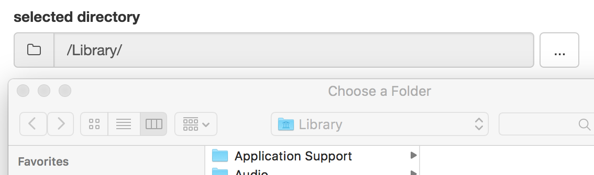

# directoryInput
A widget for interactive selection of directories for R Shiny Applications



# Application
Provides an input for users to select directories via an interactive, and os native 
dialog, rather than having to type in paths in a `textInput()`.

> **NOTE**: This is intended to only be used with _locally run_ shiny applications.  It will not work on server deployed applications because it uses OS shell calls to present a directory choosing dialog.  There is currently no way (that I'm aware) of _securely_ presenting a client side directory selection dialog from a hosted web application.

# Install the package
First install the `shiny` R-package from CRAN as it is required:

```r
install.packages('shiny')
```

Then install this package from github:

```r
devtools::install_github('wleepang/shiny-directory-input')
```

## Special Requirements

* Windows:
  * PowerShell 3 or higher

# Run the demo

Simply run the code to see the widget in action:

```r
library(shinyDirectoryInput)
shinyDirectoryInput::runDirinputExample()
```

# Use the widget

In `global.R` in your own app (create it if it doesn't already exist) add the line:

```r
library('shinyDirectoryInput')
```

### In `ui.R`:
* Add the widget
```r
directoryInput('directory', label = 'select a directory')
```

* Add the widget with a default value
```r
directoryInput('directory', label = 'select a directory', value = '~')
```


### In `server.R`:
* **Important**: Pass `session` into the server, it is used to communicate with the client-side widget
```
shinyServer(function(input, output, session) {
  # ...
}
```

* Invoke the dialog
```
path = readDirectoryInput(session, 'directory')
```

* Update the widget value
```
path = 'path/to/directory'
updateDirectoryInput(session, 'directory', value = path)
```

* Example: Observe when a user clicks the `...` button to select a new directory
```r
observeEvent(
  ignoreNULL = TRUE,
  eventExpr = {
    input$directory
  },
  handlerExpr = {
    if (input$directory > 0) {
      # condition prevents handler execution on initial app launch
      
      # launch the directory selection dialog with initial path read from the widget
      path = choose.dir(default = readDirectoryInput(session, 'directory'))
      
      # update the widget value
      updateDirectoryInput(session, 'directory', value = path)
    }
  }
)
```
